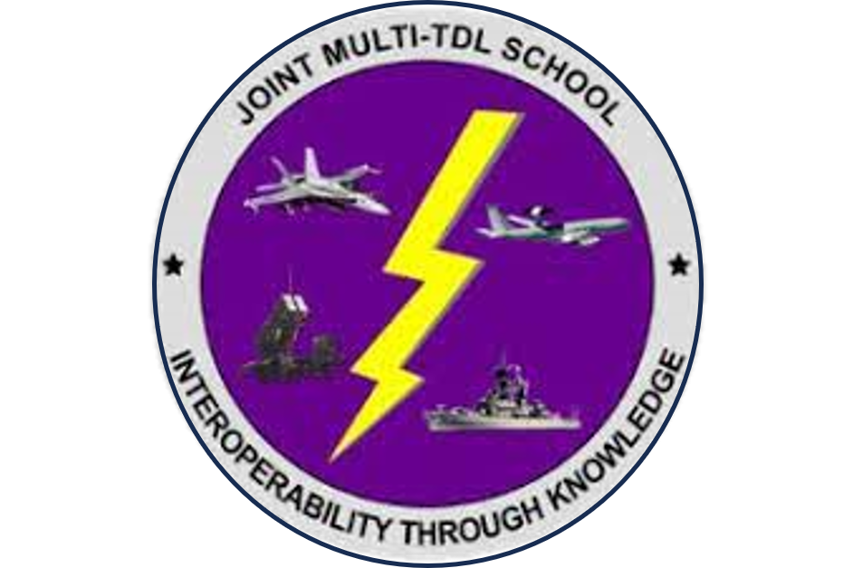
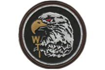
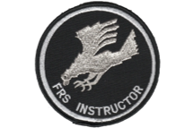

  

## **Who am I?**
 
#### Education:

  <!-- Image and caption 1 -->
  <figure>
    
    <figcaption>
      2003-2004 
      Naval Academy Prep School 
      Appointment to the U.S. Naval Academy
    </figcaption>
  </figure>

  <!-- Image and caption 2 -->
  <figure>
    
    <figcaption>
      2004-2008 
      Naval Academy 
      Bachelor of Science in Political Science
    </figcaption>
  </figure>

  <!-- Image and caption 3 -->
  <figure>
    
    <figcaption>
      2016-2021 
      College of William & Mary 
      Master of Business Administration
    </figcaption>
  </figure>

  <!-- Image and caption 4 -->
  <figure>
    
    <figcaption>
      2021-2023 
      College of William & Mary 
      Master of Science in Business Analytics
    </figcaption>
  </figure>

  <!-- Image and caption 5 -->
  <figure>
    
    <figcaption>
      2023-2024 
      Naval Postgraduate School 
      Prospective Data Science Certification
    </figcaption>
  </figure>

#### Military Qualified and Trained:

  <figure>
    
    <figcaption>
      2008-2011 
      VAW-120 Greyhawks 
      E-2C Hawkeye Naval Flight Officer
    </figcaption>
  </figure>

  <figure>
    
    <figcaption>
      2012 
      Multi-TDL Advanced Joint Interoperabilityr 
      Interface Control Officer
    </figcaption>
  </figure>

  <figure>
    
    <figcaption>
      2012 
      Marine Aviation Weapons and Tactics Squadron-1 
      USMC Weapons & Tactics Instructor
    </figcaption>
  </figure>

  <figure>
    
    <figcaption>
      2014 
      VAW-120 Greyhawks 
      E-2C/D Naval Flight Officer Instructor
    </figcaption>
  </figure>

#### Experienced Naval Officer:

  <figure>
    
    <figcaption>
      2011-2014  
      VAW-124 Bear Aces 
      Division Officer & Mission Commander
    </figcaption>
  </figure>

  <figure>
    
    <figcaption>
      2014-2017  
      VAW-120 Greyhawks 
      Division Officer & Instructor
    </figcaption>
  </figure>

  <figure>
    
    <figcaption>
      2017-2019  
      USS Abraham Lincoln CVN72 
      Tactical Action Officer
    </figcaption>
  </figure>

  <figure>
    
    <figcaption>
      2019-2022  
      VAW-120 Greyhawks 
      Department Head
    </figcaption>
  </figure>

  <figure>
    
    <figcaption>
      2022-Present  
      OPNAV N2N6 Information Warfare 
      ATDL Requirements Officer
    </figcaption>
  </figure>

#### Projects:
- [U.S. Endangered Names of Our Century](/US_Name_Records/index.md) 
- [Endangered Names Repository](https://github.com/dougrandrade/NamesRepo)

  <!-- LinkedIn link with logo only, no caption -->
  <figure>
    
  </figure>

