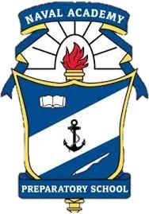
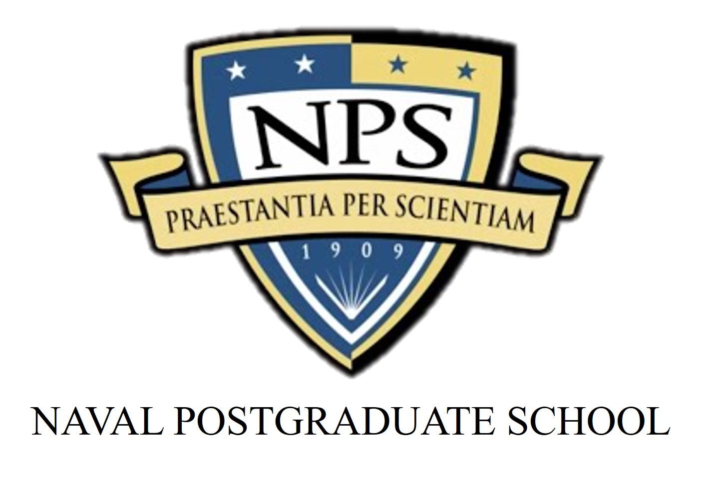
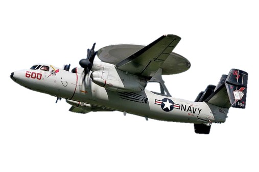

Who am I?

#### A graduate of:

  <figure style="width:23%; margin: 10px 0;">
    
    <figcaption>2004 Graduate and admitted the U.S. Naval Academy</figcaption>
  </figure>

  <figure style="width:23%; margin: 10px 0;">
    
    <figcaption>2008 Bachelor of Science in Political Science</figcaption>
  </figure>

  <figure style="width:23%; margin: 10px 0;">
    
    <figcaption>2021 MBA & 2023 Master of Science in Business Analytics</figcaption>
  </figure>

  <figure style="width:23%; margin: 10px 0;">
    
    <figcaption>Prospective 2024 Data Science Certification</figcaption>
  </figure>

A dedicated service as a U.S. Naval Officer:

  <figure style="width:23%; margin: 10px 0;">
    
    <figcaption>2010 qualifed E-2 Hawkeye Naval Flight Officer</figcaption>
  </figure>

  <figure style="width:23%; margin: 10px 0;">
    
    <figcaption>2011-2016 VAW-124 Instructor and Mission Commander in combat missions</figcaption>
  </figure>

  <figure style="width:23%; margin: 10px 0;">
    
    <figcaption>2017-2019 CVN 72 Tactical Action Officer in 6th and 5th Fleets</figcaption>
  </figure>

  <figure style="width:23%; margin: 10px 0;">
    
    <figcaption>2019-2022 VAW-120 Instructor and Department Head</figcaption>
  </figure>

  <figure style="width:23%; margin: 10px 0;">
    
    <figcaption>OPNAV N2N6 Requirements Officer</figcaption>
  </figure>

Content I have developed:
- [U.S. Endangered Names of Our Century](/US_Name_Records/index.md) 

- [Endangered Names Repository](https://github.com/dougrandrade/NamesRepo)

